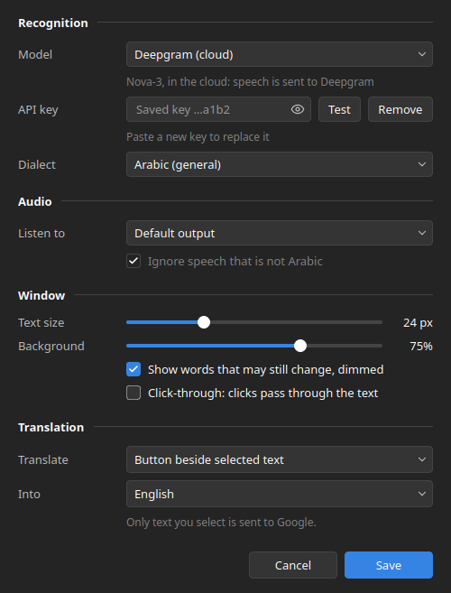

<p align="center">
  
</p>

**LiveTranscribe** shows live Arabic subtitles for anything your computer
plays — a YouTube video, a lecture, a news stream, a call. It listens to your
speakers (not your microphone), turns the Arabic speech into text, and shows
it in a small window that stays on top of everything else.

It runs on your own computer, on your graphics card if you have one, and
nothing you listen to is sent anywhere. If you prefer, it can use
[Deepgram](#deepgram-cloud) in the cloud instead, with your own API key.

<p align="center">
  
</p>

## What it does

- **Live subtitles.** White words are final. Grey words are still being
  worked out and may change a moment later.
- **Scroll back.** Earlier lines move up. Scroll up to read them again; scroll
  back down and it follows the speech.
- **Select and copy.** Select text with the mouse, then press Ctrl+C.
- **Translate.** Select some text and click the translate button that appears
  beside it. The translation opens above the window — from Google Translate,
  or offline, on your own computer.
- **Stays out of the way.** Always on top, on every workspace. Move it
  anywhere, make it bigger or smaller — it remembers.

## Install

You need **Ubuntu 24.04** or another **GNOME** desktop with **PipeWire**
(the default on current Ubuntu and Fedora), and **Python 3.10 or newer**.
An **NVIDIA graphics card** makes it fast, but is not required.

Download this folder, open a terminal in it, and run:

```bash
./install.sh
```

The installer:

1. checks that your system has what the app needs, and tells you the exact
   command if something is missing;
2. sets up the app's own Python environment (in the `.venv` folder here);
3. downloads the speech model (about 480 MB), after asking;
4. adds **LiveTranscribe** to your app menu.

It never needs `sudo` itself. Run it again at any time — it only does what is
still missing.

## Start it

Press the **Super** key (the Windows key), type **LiveTranscribe**, and press
Enter. Then play something with Arabic speech.

The first start takes a few seconds while the speech model loads; the window
says `Loading Whisper small…` meanwhile.

## The window

Over a video the window shows only the text and a small dot. Move the mouse
over it and the controls appear in the top bar; they fade away again when the
mouse leaves.

| | |
|---|---|
| **The dot** | What the app is doing. **Green**: listening — dim in silence, bright while it hears speech. **Amber**: loading, or running on the processor (slower). **Grey**: paused. **Red**: something went wrong — the top bar says what. |
| **Top bar** | Under the mouse it shows the model, the device and the sound level: `small · GPU · -18 dB`. |
| **🔓 / 🔒** | Click-through. When locked (the lock turns blue), clicks on the text go to whatever is under the window (a video's controls, for example). The top bar always stays clickable — point at it and click the lock again to unlock. |
| **⏸ / ▶** | Pause and resume. While paused, nothing is listened to at all. |
| **⚙** | Settings |
| **✕** | Quit |
| **Move** | Drag the top bar |
| **Resize** | Drag the bottom-right corner |
| **Right-click the text** | Copy · Select all · Copy whole transcript · Clear window · Translate selection · Translation options |

A text file of everything said is also kept for each session: right-click the
tray icon (top bar of the screen) → **Open transcript file**.

## Translation

When you select text, a small translate button appears beside it.
Click it and the translation opens above the window, with a copy button.

Right-click the text → **Translation** to choose how it works:

- **Off**
- **Show a translate button on selected text** (the default)
- **Translate as soon as text is selected**

…what translates — **Google Translate** or **Offline (NLLB-200)** — and which
language to translate into. Your choice is remembered.

**Google Translate** is the default and needs the internet: only the text
you select is sent to Google. It is free and unofficial, and Google sometimes
refuses a network that has asked too often. The app then waits a few minutes
before asking again (asking while refused can make it last longer), and the
popup says how long. Text you have already translated is shown again without
asking.

**Offline** translates on your computer with Meta's NLLB-200 model; nothing
is sent anywhere and nothing can be refused. Choose it in **⚙ → Translation
→ With**, then click **Download** (640 MB, once). It takes a second or two
the first time, then well under a second a sentence on a graphics card. Google
is usually a little more fluent. NLLB-200 is licensed for non-commercial use
only (CC-BY-NC 4.0).

## Deepgram (cloud)



Instead of your own computer, LiveTranscribe can use **Deepgram**'s Nova-3
model, which knows Arabic and its dialects. It needs no graphics card, but it
needs the internet and a Deepgram account, and Deepgram charges for the audio
it hears.

1. Create an API key at [console.deepgram.com](https://console.deepgram.com)
   → **API Keys**.
2. Click **⚙**, set **Model** to **Deepgram (cloud)**, and paste the key into
   **API key**. **Test** says whether Deepgram accepts it; 👁 shows what you
   typed, until you save.
3. Choose the **Dialect**, or leave it on **Arabic (general)**.
4. **Save**. The top bar says `Deepgram nova-3 · cloud`.

Only speech is sent: silence and music between sentences are not, so they
cost nothing. Grey and white words work as before — grey is Deepgram's first
guess, white its final answer.

**The key is kept in your system keyring** (GNOME Keyring, the same place
your browser and Wi-Fi passwords are), encrypted and unlocked when you log
in — not in a settings file. Once saved, it is never shown again: the field
stays empty and says only `Saved key …a1b2`, its last four characters. Paste
a new key to replace it, or click **Remove** to delete it. To use a key
without saving it anywhere, start the app with it in the `DEEPGRAM_API_KEY`
environment variable; that one wins and is never saved.

**Ignore speech that is not Arabic** does not work with Deepgram.

<br clear="right">

## Settings


Click **⚙** in the window. Your choices are saved and used every time the app
starts. Text size and background change in the window as you drag them;
**Cancel** puts them back. When a change needs the model reloaded or
listening restarted, the dialog says so beside **Save**.

- **Recognition**
  - **Model** — `small` is fast and the default, and the installer downloads
    it. `large-v3` is more accurate but several times slower; `large-v3-turbo`
    comes close to it at a fraction of the cost. A model that is not on your
    computer yet shows its size: choose it and click **Download** under it. A
    progress bar shows how far it got, and **Cancel** stops it. It keeps going
    if you close the settings, and the window says when it is done. **Save**
    waits until the chosen model is there.
    **Deepgram (cloud)** sends the speech to Deepgram instead; see
    [Deepgram (cloud)](#deepgram-cloud).
  - **Run on** — the graphics card (GPU) or the processor (CPU).
  - **API key**, **Dialect** — for Deepgram only, in place of **Run on**.
- **Audio**
  - **Listen to** — your default speakers, or a specific output.
  - **Ignore speech that is not Arabic** — English speech is left out instead
    of being written in Arabic letters.
- **Window**
  - **Text size**, **Background** opacity.
  - **Show words that may still change** — turn off to see only final words.
  - **Click-through** — see above.
- **Translation** — **Translate** (off, a button, or at once), **With**
  (Google Translate, or Offline, which downloads the same way as a model) and
  **Into** which language; see [Translation](#translation).
- **Advanced** (click to open) — **Precision**, and **Update every**: how
  often the text is refreshed. Whisper only.

<br clear="right">

## If something is wrong

**No text appears.**
Point at the window and look at the top bar. If it says `silent` while
something is playing, the sound is going to a different output — choose it in
⚙ → **Listen to**.

**The text comes slowly.**
If the dot is amber and the top bar says `CPU`, the graphics card is not being
used. Check that
`nvidia-smi` works in a terminal. On Ubuntu, a kernel update can leave the
NVIDIA driver behind; this usually fixes it:
`sudo apt install linux-modules-nvidia-595-open-generic-hwe-24.04`, then restart.

**I can't click the window.**
Click-through is on: point at the top bar and click the blue **🔒**. If anything else goes wrong
with the settings, right-click the LiveTranscribe icon in the app menu →
**Start with default settings**.

**A fullscreen video hides the window.**
Start it with `./run.sh --bypass-wm`, or hold Super, right-click the window's
top bar and choose **Always on Top**.

**Deepgram: the dot is red.**
The top bar says why. *Deepgram rejected the API key* — open ⚙ and click
**Test** with the field empty to check the saved key, or paste a new one. *Out of credit* — top up the Deepgram account, then pause and
resume. If the dot is amber and says *trying again*, the internet connection
dropped; it reconnects by itself and does not lose the sentence in progress.

**Some words are wrong.**
Clear standard Arabic (news, lectures) works best. Dialects and speech over
loud music are harder. The `large-v3` model is more accurate, but slower.

## Privacy

With a Whisper model, speech recognition runs entirely on your computer and
audio never leaves it; the only exception is translation with Google, and
only for text you select. Offline translation sends nothing. Downloading a
model in the settings connects to Hugging Face, only when you click Download.

With **Deepgram**, the speech you play is sent to Deepgram while it is
playing (silence and music are not), under your Deepgram account and
[its privacy policy](https://deepgram.com/privacy). Nothing else is.

## Uninstall

```bash
./install.sh --uninstall     # removes it from the app menu
./install.sh --purge         # ...and its Python environment, saved settings and Deepgram key
```

Then delete this folder.

---

For developers: how it works, measurements and tests are in
[docs/DEVELOPMENT.md](docs/DEVELOPMENT.md).
