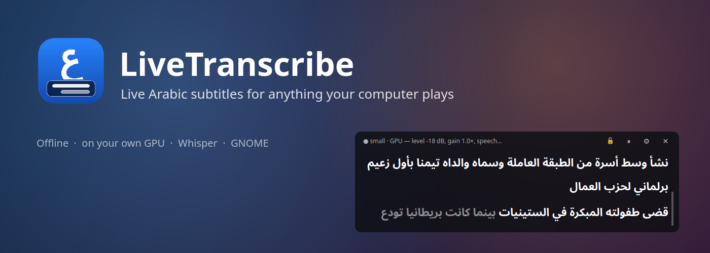
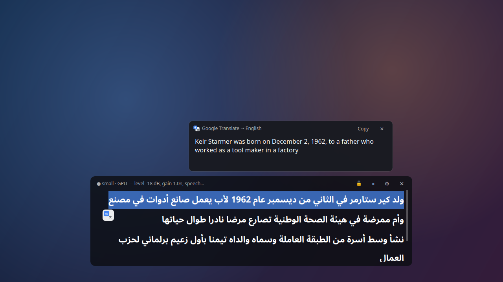
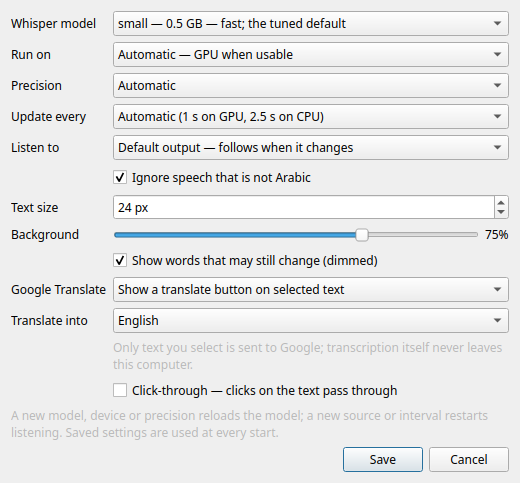

<p align="center">
  
</p>

**LiveTranscribe** shows live Arabic subtitles for anything your computer
plays — a YouTube video, a lecture, a news stream, a call. It listens to your
speakers (not your microphone), turns the Arabic speech into text, and shows
it in a small window that stays on top of everything else.

It all runs on your own computer, on your graphics card if you have one.
Nothing you listen to is sent anywhere.

<p align="center">
  
</p>

## What it does

- **Live subtitles.** White words are final. Grey words are still being
  worked out and may change a moment later.
- **Scroll back.** Earlier lines move up. Scroll up to read them again; scroll
  back down and it follows the speech.
- **Select and copy.** Select text with the mouse, then press Ctrl+C.
- **Translate.** Select some text and click the translate button that appears
  beside it. The translation opens above the window, from Google Translate.
- **Stays out of the way.** Always on top, on every workspace. Move it
  anywhere, make it bigger or smaller — it remembers.

## Install

You need **Ubuntu 24.04** or another **GNOME** desktop with **PipeWire**
(the default on current Ubuntu and Fedora), and **Python 3.10 or newer**.
An **NVIDIA graphics card** makes it fast, but is not required.

Download this folder, open a terminal in it, and run:

```bash
./install.sh
```

The installer:

1. checks that your system has what the app needs, and tells you the exact
   command if something is missing;
2. sets up the app's own Python environment (in the `.venv` folder here);
3. downloads the speech model (about 480 MB), after asking;
4. adds **LiveTranscribe** to your app menu.

It never needs `sudo` itself. Run it again at any time — it only does what is
still missing.

## Start it

Press the **Super** key (the Windows key), type **LiveTranscribe**, and press
Enter. Then play something with Arabic speech.

The first start takes a few seconds while the speech model loads; the window
says `Loading Whisper small…` meanwhile.

## The window

| | |
|---|---|
| **Top bar** | Shows what the app is doing: `● small · GPU — level -18 dB, speech…` |
| **🔓 / 🔒** | Click-through. When locked 🔒, clicks on the text go to whatever is under the window (a video's controls, for example). The top bar always stays clickable — click 🔒 again to unlock. |
| **⏸ / ▶** | Pause and resume. While paused, nothing is listened to at all. |
| **⚙** | Settings |
| **✕** | Quit |
| **Move** | Drag the top bar |
| **Resize** | Drag the bottom-right corner |
| **Right-click the text** | Copy · Select all · Copy whole transcript · Clear window · Translate selection · Google Translate options |

A text file of everything said is also kept for each session: right-click the
tray icon (top bar of the screen) → **Open transcript file**.

## Translation

When you select text, a small translate button (a blue **G** tile) appears
beside it. Click it and the translation opens above the window, with a
**Copy** button.

Right-click the text → **Google Translate** to choose how it works:

- **Off**
- **Show a translate button on selected text** (the default)
- **Translate as soon as text is selected**

…and which language to translate into. Your choice is remembered.

> Translation is the only thing that uses the internet: only the text you
> select is sent to Google Translate. If Google is busy it may refuse for a
> while — the popup will say so.

## Settings



Click **⚙** in the window. Your choices are saved and used every time the app
starts.

- **Whisper model** — `small` is fast and the default. `large-v3` is more
  accurate but several times slower (download it with any Whisper tool first).
- **Run on** — the graphics card (GPU) or the processor (CPU).
- **Update every** — how often the text is refreshed.
- **Listen to** — your default speakers, or a specific output.
- **Ignore speech that is not Arabic** — English speech is left out instead of
  being written in Arabic letters.
- **Text size**, **Background** opacity.
- **Show words that may still change** — turn off to see only final words.
- **Google Translate** and **Translate into** — see above.

<br clear="right">

## If something is wrong

**No text appears.**
Look at the top bar. If it says `silent` while something is playing, the sound
is going to a different output — choose it in ⚙ → **Listen to**.

**The text comes slowly.**
If the top bar says `CPU`, the graphics card is not being used. Check that
`nvidia-smi` works in a terminal. On Ubuntu, a kernel update can leave the
NVIDIA driver behind; this usually fixes it:
`sudo apt install linux-modules-nvidia-595-open-generic-hwe-24.04`, then restart.

**I can't click the window.**
Click-through is on: click **🔒** in the top bar. If anything else goes wrong
with the settings, right-click the LiveTranscribe icon in the app menu →
**Start with default settings**.

**A fullscreen video hides the window.**
Start it with `./run.sh --bypass-wm`, or hold Super, right-click the window's
top bar and choose **Always on Top**.

**Some words are wrong.**
Clear standard Arabic (news, lectures) works best. Dialects and speech over
loud music are harder. The `large-v3` model is more accurate, but slower.

## Privacy

Speech recognition runs entirely on your computer; audio never leaves it. The
only exception is translation, and only for text you select.

## Uninstall

```bash
./install.sh --uninstall     # removes it from the app menu
./install.sh --purge         # ...and its Python environment and saved settings
```

Then delete this folder.

---

For developers: how it works, measurements and tests are in
[docs/DEVELOPMENT.md](docs/DEVELOPMENT.md).
